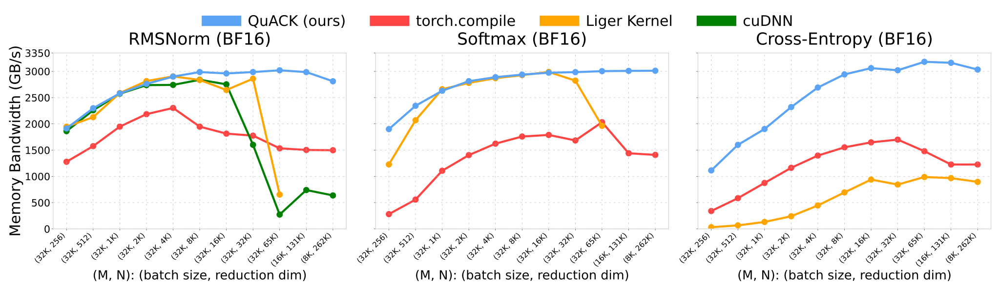

# 🦆 QuACK: A Quirky Assortment of CuTe Kernels 🦆

Kernels are written in the [CuTe-DSL](https://docs.nvidia.com/cutlass/latest/media/docs/pythonDSL/cute_dsl_general/dsl_introduction.html).

## Installation

``` bash
# For CUDA 12.9:
pip install quack-kernels

# For CUDA 13.x:
pip install 'quack-kernels[cu13]' --extra-index-url https://download.pytorch.org/whl/cu130

# Do not use uv for CUDA 13.x installs yet: it can race/install
# nvidia-cutlass-dsl[cu13] in the wrong order (NVIDIA/cutlass#3259):
# https://github.com/NVIDIA/cutlass/issues/3259

# Optional: install NVIDIA matmul heuristics for better untuned GEMM configs
pip install 'quack-kernels[heuristics]'

# Optional: JAX bindings (pulls in jax and jax-tvm-ffi)
pip install 'quack-kernels[jax]'
```

## Requirements

- H100, B200/B300, or RTX 50 GPU
- CUDA toolkit 12.9+
- Python 3.12

## Kernels 🐥

- 🦆 RMSNorm forward + backward
- 🦆 Softmax forward + backward
- 🦆 Cross entropy forward + backward
- 🦆 Layernorm forward + backward
- 🦆 Hopper gemm + epilogue
- 🦆 Blackwell gemm + epilogue
- 🦆 Blackwell GeForce gemm + epilogue

## Usage

```
from quack import rmsnorm, softmax, cross_entropy
```

JAX bindings are also available for some kernels (see [docs/jax.md](docs/jax.md)):

```
from quack.softmax_jax import softmax
```

## Documentations

- [JAX interface](docs/jax.md) — optional `jax` + `jax-tvm-ffi` bindings, see `quack/softmax_jax.py` for an example.

[2025-07-10] We have a comprehensive
[blogpost](media/2025-07-10-membound-sol.md) on how to get memory-bound kernels
to speed-of-light, right in the comfort of Python thanks to the [CuTe-DSL](https://docs.nvidia.com/cutlass/media/docs/pythonDSL/cute_dsl_general/dsl_introduction.html).

## Performance

<div align="center">
<figure>
  
</figure>
</div>

See our [blogpost](media/2025-07-10-membound-sol.md) for the details.

## Development

To set up the development environment:

```bash
pip install -e '.[dev]'
pre-commit install

# For CUDA 13.x:
pip install 'quack-kernels[dev,cu13]' --extra-index-url https://download.pytorch.org/whl/cu130

# Do not use uv for CUDA 13.x installs yet; use pip instead.
# See https://github.com/NVIDIA/cutlass/issues/3259
```

## Conda development environment (CUDA 12.9)

Create a clean environment rather than cloning an existing environment, which may bring in
incompatible CUDA or CUTLASS packages:

```bash
conda create --name zh_quack_env312 python=3.12 pip -y
conda activate zh_quack_env312
python -m pip install --upgrade pip
```

From the repository root, install the CUDA 12.9 build of PyTorch first. Using the CUDA-specific
index prevents pip from selecting a CUDA 13 build that requires a newer driver:

```bash
python -m pip install "torch==2.13.0" \
  --index-url https://download.pytorch.org/whl/cu129
python -m pip install \
  "cuda-python==12.9.4" \
  "cuda-bindings==12.9.4"
```

Install QuACK in editable mode so changes to this checkout are used by new Python processes:

```bash
python -m pip install -e '.[dev]'
```

Validate the environment and editable installation:

```bash
python -m pip check
python -c "import quack, torch; print(torch.__version__, torch.version.cuda); print(torch.cuda.is_available()); print(quack.__file__)"
```

Finally, run a small numerical GPU check:

```bash
python - <<'PY'
import torch

from quack.softmax import softmax

x = torch.randn(2, 1024, device="cuda", dtype=torch.bfloat16)
y = softmax(x)
torch.testing.assert_close(y, torch.softmax(x, dim=-1), atol=1e-2, rtol=1e-2)
print("QuACK works:", y.shape, torch.cuda.get_device_name())
PY
```
